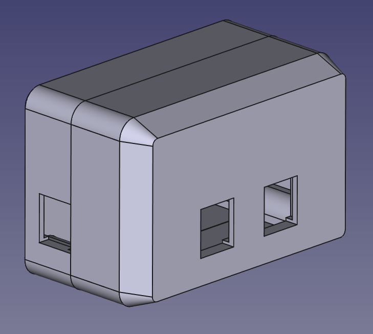
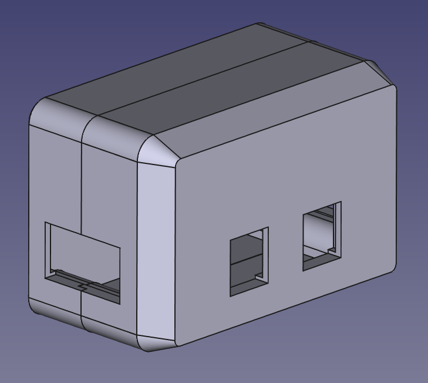
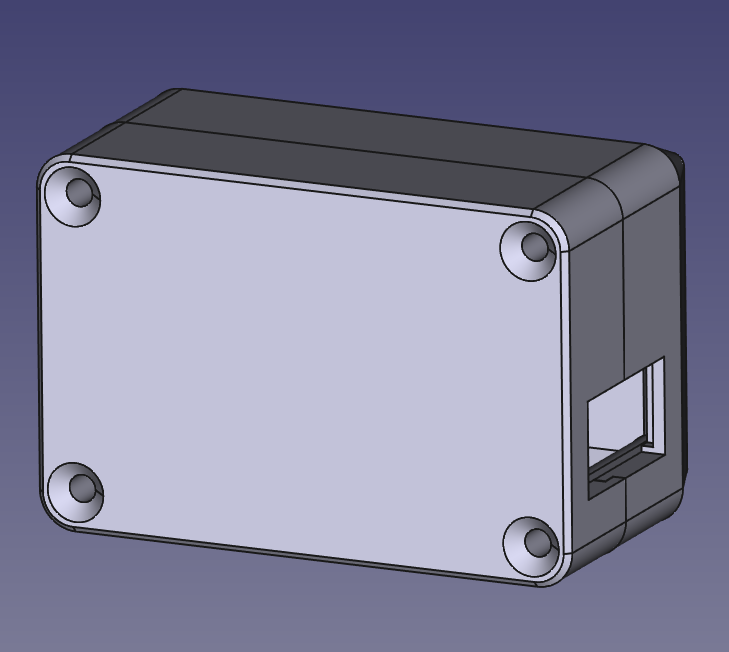

<!-- LTeX: language=de-DE -->

# LN-Box

LN-Box Gehäuse für übliche Verteiler-Platinen.

<table>
  <tbody>
    <tr>
      <td>
        
      </td>
      <td>
        
      </td>
      <td>
        
      </td>
    </tr>
  </tbody>
</table>

<dl>
  <dt>LN-Box 1x1</dt>
  <dd>Standard-Verteiler mit je einer seitlichen Öffnung
  <dt>LN-Box 2x2</dt>
  <dd>Verteiler mit je zwei seitlichen Öffnungen (Abzweig/Anschluss)
</dl>

Empfohlene Schrauben:

4x [M4x25 Torx selbstschneidend](https://www.amazon.de/dp/B0CYH2SN8N)

## Lizenz

[Creative Commons Attribution-ShareAlike 4.0 International License](http://creativecommons.org/licenses/by-sa/4.0/).

